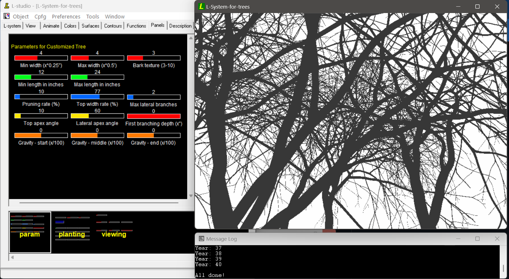

# L-System-for-trees
 A parametric L-system to study the rhythm of tree growth and pruning, based upon CFPG developed by Univ of Calgary.

<PRE>
--- extracted from tree.l ---
/* An experimental forest with trees for my art study. The trees are
 * with no leaves; I'm only interested in the bones that create rhythms
 * over the sequence of events in nature, i.e., the plant biology and tropism.
 * The trees are developed using the L-system fractal and simulated using
 * CPFG developed by Univ. of Calgary. Although tree growth is heavily relied
 * upon the plant biology, I model trees as how they look at the end of growth
 * rather than growing them biologically. For instance, I do not model tree
 * branches to get thicker as they accumulate nutrients from leaves, but
 * calculate their width according to the Da Vinci's observation.
 *
 * Here are formulae that I'm using in the system:
 *
 * 1. Calculation of the next top/lateral width
 * I use the Da Vinci formula, which states that the influx and outflux
 * are the same amount at any tree branches.
 * Suppose w1, w2, w3i are the width of mother branch, top and i-th lateral
 * branch, respectively. Then, w1^2 = w2^2 + w31^2 + w32^2 + ... + w3n^2.
 * For simplicity, I assume that all lateral branches have the same mean width.
 * I.e., w1^2 = w2^2 + n*w31^2.
 * The leadership of top (w2) is denoted as r = w2/w1.
 * That is, w2 = r*w1, w31 = sqrt((1-r^2)/n) * w1.
 *
 * 2. Calculation of the length of the current internode
 * Thicker branches look longer as the result of pruning.
 * TODO: we probably do not need this tweak if pruning does a good job.
 *
 * 3. Pruning apexes
 * Lateral branches die as they get old due to lack of light or space. 
 * I prun branches more at the initial stage using a power function.
 *
 * 4. Estimate life time of a branch
 * Several calculation is based upon the estimated life of a branch in years.
 * Assuming branching occurs every year, the width at n-th year will be
 * w*r^n, where n needs to be adjusted for the year when no branching occurs.
 *
 * 5. Other notes
 * - All measurements are in foot.
 * - Each iteration of my L-system represents a year.
 * - Deterministic productions (rather than stochastic) are used; 
 *   Hence, the order of the productions in the program are important.
 *
 * by Pyungchul Kim, 2024
 * https://orderedrandom.com
 */
</PRE>

This program requires L-Studio to be installed. The following are steps for a quick start. It is based upon Windows 11, but it should work for other platforms.
1. Download files from this repository.
2. Download and install L-Studio from http://algorithmicbotany.org/virtual_laboratory/. I tested with L-studio ATE 4.4.1-2976 (July 13, 2016).
3. Start L-studio, select the menu "Object" --> "Open...", and locate the folder where this repository is downloaded.
4. In L-studio, select the menu "CFG" --> "Go". It should pop up an animation screen.
5. In the animation screen, press Ctrl-R. It should start drawing trees.
6. See L-Studio documentations (installed) to learn how to use it. In particular, there are several panels I created to experiment different types of trees and their mixtures.

 
